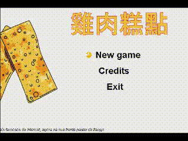

# Pastel de Flango
<table>
  <tr>
    <th>
      
    </th>
  </tr>
</table>

## Overview

Pasteldeflango is a casual arcade project that blends internet meme culture with classic gaming mechanics. Built from the ground up using Java, the game challenges players' reaction times as they help the main character catch every falling chicken pastry. This project demonstrates core game development principles, such as game loop implementation, collision detection, and state management (menu, gameplay, and credits), all presented with a charming and nostalgic pixel-art aesthetic.

<b> Tools</b>
* Eclipse.org
* Paint.NET

<b>Credits</b>
 
1. Song

* 

The game was made in java.
I accept any kind of suggestions

Note: The project is constantly evolving, when it is finished it will no longer be open source.

### Good luck :)
