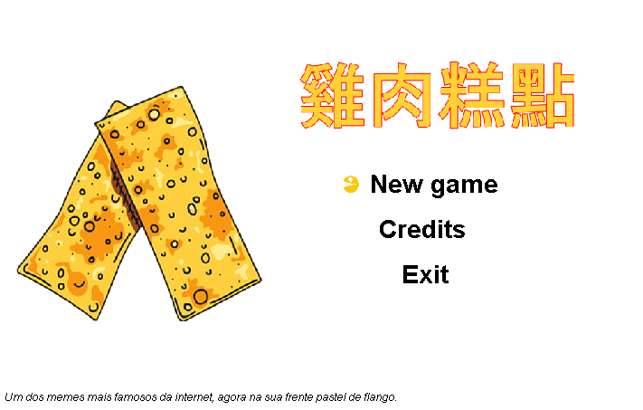

# Pastel de Flango
<table border="1">
  <tr>
    <th>
      
    </th>
  </tr>
</table>

## Flango pastel

It is a game alluding to the famous meme "pastel de flango", the game consists of feeding our Asian friend to eat all the chicken pastries that are appearing, as you cannot waste food so you cannot let any pastel fall on the floor.

<b> Tools</b>
* Eclipse.org
* Paint.NET

<b>Credits</b>
 
1. Song

* 

The game was made in java.
I accept any kind of suggestions

Note: The project is constantly evolving, when it is finished it will no longer be open source.

### Good luck :)
